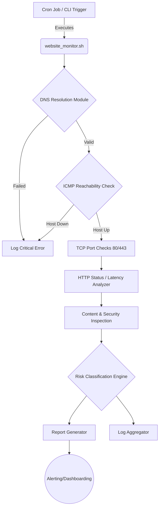
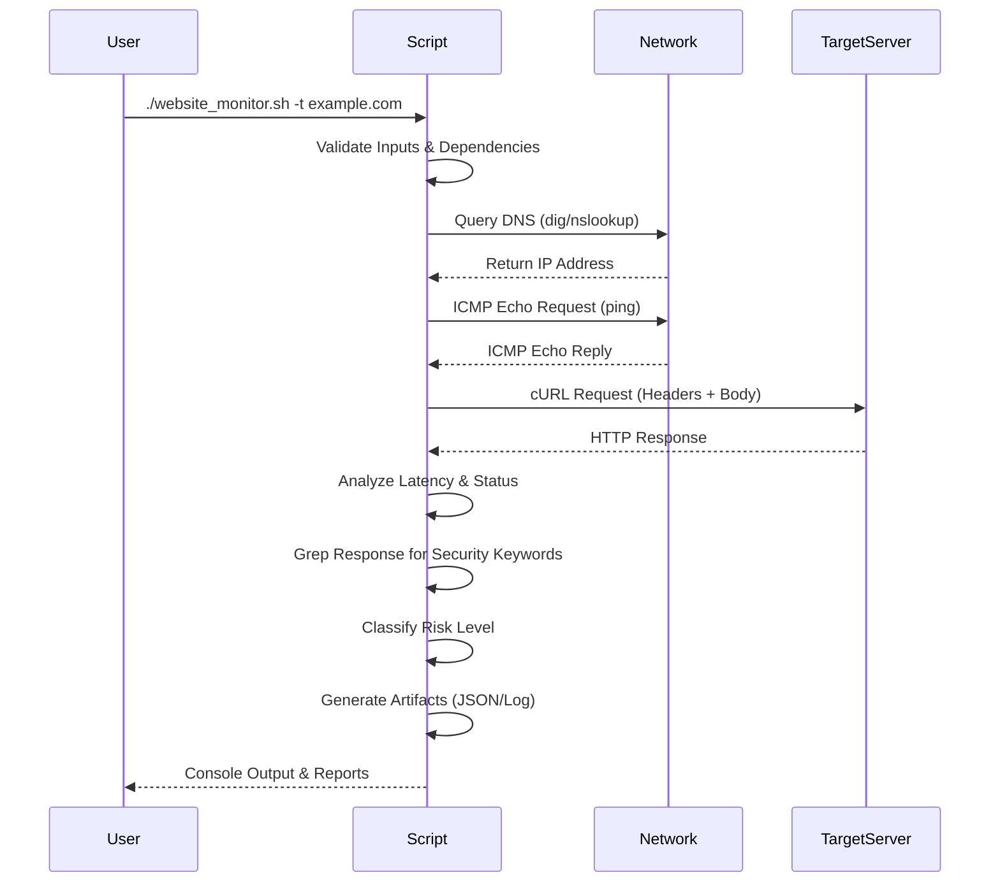
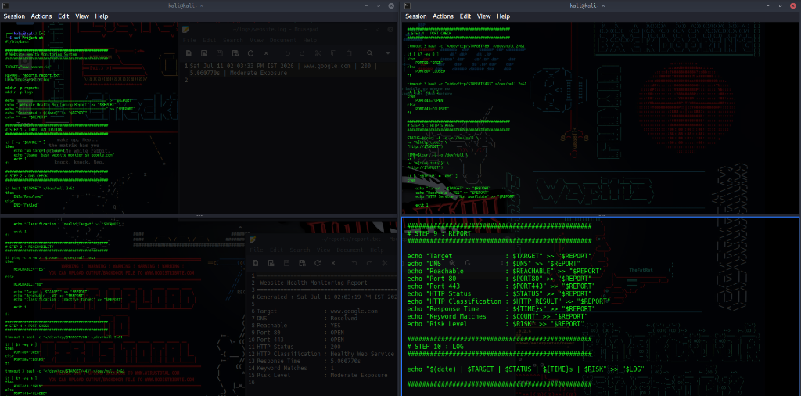
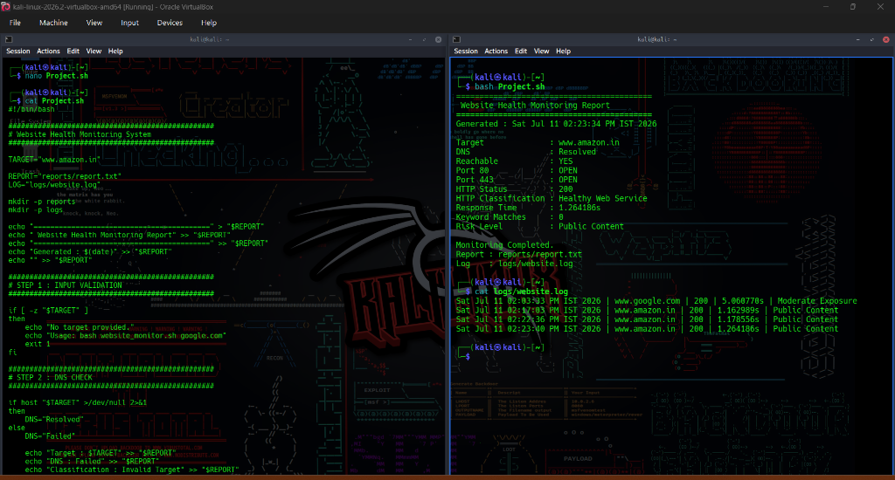

<div align="center">

<!-- Hero Banner (Replace with actual image path/URL) -->


<!-- Animated Typing Header -->
<h1>
  <a href="https://git.io/typing-svg">
    
  </a>
</h1>

<!-- Professional Badges -->
<p align="center">
  
  
  
  
 
</p>

A comprehensive, automated Linux Bash utility engineered to validate DNS resolution, evaluate network connectivity, monitor web services (HTTP/HTTPS), and proactively detect security exposures in real-time.

[Report Bug](https://github.com/yourusername/website-health-monitoring/issues) · [Request Feature](https://github.com/yourusername/website-health-monitoring/issues) · [View Documentation](docs/)

</div>

---

## 📖 Project Overview

The **Website Health Monitoring System** is a robust shell automation framework designed for Security Operations Center (SOC) analysts, DevOps engineers, and system administrators. It transcends standard uptime checking by incorporating advanced features such as intelligent HTTP response analysis, real-time performance tracking, and deep-content inspection for security misconfigurations and exposure risks. 

Built entirely in Bash, it demonstrates deep mastery of Linux automation, system internals, network protocols, and secure scripting best practices.

---

## ⚡ Core Features

<details>
  <summary><b>🔍 View Comprehensive Feature List</b></summary>
  <br>
  
- **DNS Resolution Engine**: Deep verification of A/AAAA records with robust error handling.
- **Network Reachability Validation**: ICMP latency tracking and packet loss detection.
- **Service Monitoring**: Granular checks for TCP Port 80 (HTTP) and TCP Port 443 (HTTPS) availability.
- **HTTP State Detection**: Comprehensive tracking and logging of exact HTTP status codes (200, 301, 403, 500, etc.).
- **Response Time Analytics**: Microsecond-accurate latency measurement.
- **Security Content Inspection**: Greps HTML responses for sensitive keyword exposure (e.g., "SQL syntax", "Stack trace").
- **Dynamic Risk Classification**: Evaluates findings and classifies operational risk (Low, Medium, High, Critical).
- **Automated Reporting Engine**: Generates timestamped, structured TXT/JSON output artifacts.
- **Comprehensive Logging**: Syslog-compatible rotating application logs for auditing.
</details>

---

## 🏗 Architecture & Workflow

### Architecture Diagram



### Execution Pipeline



---

## 📁 Repository Structure

```text
website-health-monitoring/
├── assets/
│   ├── banner.png             # Project banner image
│   ├── architecture.svg       # SVG Architecture diagram
│   ├── workflow.svg           # SVG Workflow diagram
│   └── demo.svg               # Terminal execution demo
├── docs/
│   ├── Project_Report.pdf     # Formal executive report
│   ├── Architecture.md        # Detailed architecture docs
│   └── Networking.md          # Technical networking concepts
├── reports/                   # Auto-generated runtime reports
├── logs/                      # Rotating execution logs
├── website_monitor.sh         # Main executable script
├── config.env                 # User configurations & thresholds
├── .gitignore
├── LICENSE
├── SECURITY.md
├── CONTRIBUTING.md
├── CODE_OF_CONDUCT.md
└── README.md
```

---

## 🚀 Getting Started

### Prerequisites

The script leverages native Linux utilities and standard networking tools. Ensure the following dependencies are installed:
- `bash` (v4.0+)
- `curl`
- `ping` (iputils)
- `bind9-dnsutils` (`dig`, `nslookup`)
- `jq` (Optional, for JSON report parsing)

### Installation Guide

1. **Clone the repository:**
   ```bash
   git clone https://github.com/yourusername/website-health-monitoring.git
   cd website-health-monitoring
   ```

2. **Make the script executable:**
   ```bash
   chmod +x website_monitor.sh
   ```

3. **(Optional) Configure environment variables:**
   ```bash
   cp config.env.example config.env
   nano config.env
   ```

### Usage Examples

**Basic Health Check:**
```bash
./website_monitor.sh google.com
```

**Run as Background Job:**
```bash
nohup ./website_monitor.sh google.com &
```

**View the Generated Report:**
```bash
cat reports/report.txt
```

---

## ⚙️ Technical Implementation

### Monitoring Pipeline
The pipeline uses modular bash functions. Each check (`check_dns`, `check_icmp`, `check_http`) updates a global state array, ensuring atomic, stateless operations that can be easily parallelized in future updates.

### Detection Logic & Content Inspection
Utilizing high-performance `grep` against `curl` outputs, the tool searches for an internal array of RegEx signatures (e.g., `(?i)(sql syntax error|root:|Exception in thread)`).

### Risk Classification
- **🟢 Low**: Standard 200 OK, latency < 200ms, no keywords.
- **🟡 Medium**: 403 Forbidden, Latency > 500ms.
- **🟠 High**: 500 Internal Server Error, specific non-critical information disclosure.
- **🔴 Critical**: DNS Failure, Complete timeout, severe stack trace exposure.

---

## 📊 Sample Output

### Terminal Execution (Kali Linux)
<div align="center">
  
</div>

### Generated Logs & Reports
<div align="center">
  
</div>

### JSON Report Structure
```json
{
  "timestamp": "2026-07-11T12:00:00Z",
  "target": "example.com",
  "dns_resolved": true,
  "icmp_latency_ms": 42.1,
  "http_status": 200,
  "response_time_ms": 115,
  "security_exposure": false,
  "risk_level": "LOW"
}
```

---

## 🧠 Skills Demonstrated

This project is a testament to the following technical proficiencies:
- **Advanced Linux Scripting**: Modular functions, arrays, trap signals, strict error handling (`set -euo pipefail`).
- **Network Security**: DNS, TCP/IP fundamentals, HTTP status code analysis, application layer inspection.
- **DevOps/Automation**: CI/CD readiness, log rotation, structured data output (JSON/CSV).
- **System Architecture**: Separation of concerns, state management, and configuration driven execution.

## 📈 Roadmap & Future Improvements

- [ ] Implement Asynchronous/Parallel multi-target processing.
- [ ] Add explicit SSL/TLS Certificate Expiration validation (`openssl`).
- [ ] Integrate with Slack/Telegram/Discord webhooks for critical alerting.
- [ ] Support dynamic WHOIS and Geo-IP lookups.
- [ ] Build a local HTML dashboard generator.

---

<div align="center">
  
**Developed by [Srinivasulu Kamarthi]**

[](https://linkedin.com/in/kamarthi-srinivasulu-1336ba382/)
[](https://github.com/srinu2307)

<br>
  

*(Visitor Counter Placeholder)*
<!--  -->

</div>
